# Desafio Bootcamp Santander/DIO - Simulando um Ataque de Brute Force de Senhas com Medusa e Kali Linux

Todo o projeto foi baseado nas seguintes configurações abaixo:
  - Oracle VirtualBox: https://www.virtualbox.org
  - Kali Linux: https://www.kali.org
  - Metasploitable 2: https://sourceforge.net/projects/metasploitable/files/Metasploitable2

Tanto o Kali Linux e o Metasploitable 2 foram configurados na virtualbox no modo de rede host-only, para conseguirem se comunicar entre si.
   - IP do Kali Linux: 192.168.56.102
   - IP do Metasploitable 2: 192.168.56.101

Para testarmos se realmente a conectividade funcionou o codigo abaixo foi utilizado:

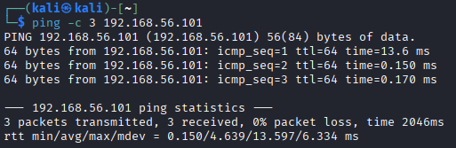

-c 3: Envia 3 pacotes ICMP para o IP desejado

TESTE 1: Executando um BruteForce no serviço FTP

Etapa 1: Verificar portas abertas
Reconhecimento:
  - Primeiro foi feito uma verificação de quais portas estão abertas no IP do Metasploitable 2 usando o nmap

    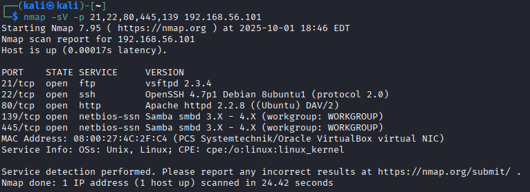

    -sV: Detecta versões de serviços/sistemas
  
    -p: Escaneia portas específicas (foram utilizadas neste teste as seguintes portas: [21 - FTP, 22 - SSH, 80 - HTTP, 139 - NetBios, 445 - SMB])
  - Confirmação do FTP ativo ao tentar se conectar no IP:

    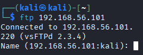

Etapa 2: Criar uma wordlist para executar um bruteforce
  - Criando uma wordlist para users.txt

    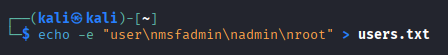

  - Criando uma wordlist para passwords.txt

    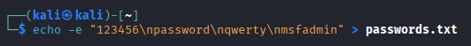

Etapa 3: Utilizando o Medusa para realizar o bruteforce

   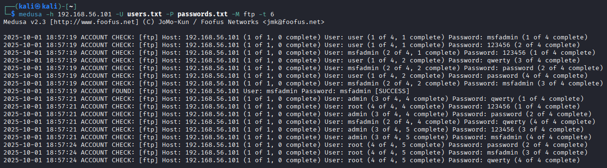

-h: Utilizado para determinar o host do ataque - 192.168.56.101

-U: Utilizado para determinar um arquivo de lista de usernames - users.txt

-P: Utilizado para determinar um arquivo de lista de passwords - passwords.txt

-M: Especifica o serviço a ser atacado - FTP

-t: Numero de tentativas (threads) por vez (quanto maior o numero, mais rapido, porém mais facil de detectar) - 6

Etapa 4: Conectando no serviço FTP
  - Utilizando as credenciais encontradas para se conectar (login: msfadmin, pass: msfadmin)

    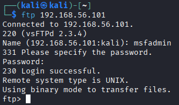

TESTE 2: Automação de Tentativas em Formulário Web (DVWA)

Etapa 1: Entender como funciona o formulário web
  - Ao abrir o navegador e entrando no site http://192.168.56.101/dvwa/login.php descobrimos um sistema de login

    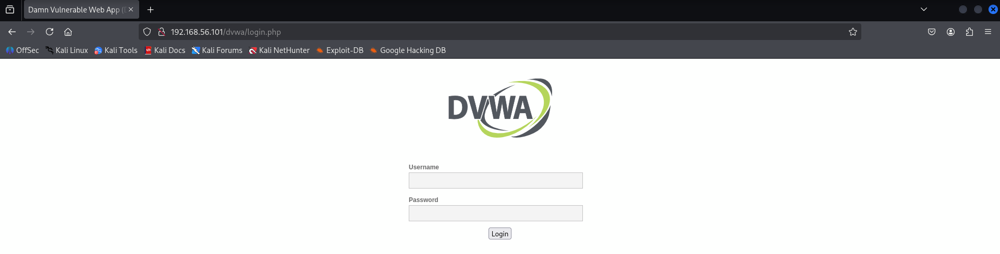

Etapa 2: Criar uma wordlist para executar um bruteforce
  - Criando uma wordlist para users.txt

  - Criando uma wordlist para passwords.txt

Etapa 3: Utilizando o Hydra (Medusa não estava funcionando corretamente) para executar o bruteforce

  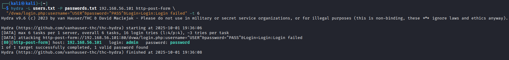

Etapa 4: Conectando no serviço HTTP

  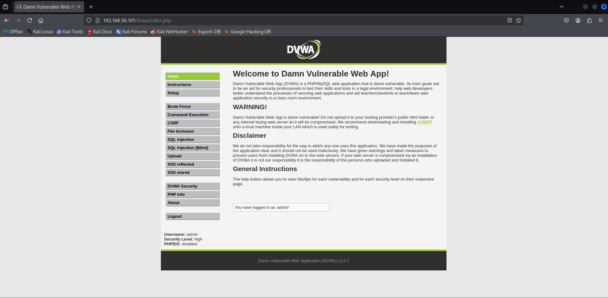

TESTE 3: Password Spraying em SMB com Enumeração de Usuários

Etapa 1: Verificando os usuários existentes
  - Utilizando o comando para enumerar os usuários

    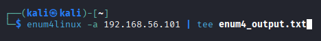

    -a: Utilizar todas as técnicas de enumeração

  - Abrindo o arquivo .txt e descobrindo os usuários existentes

    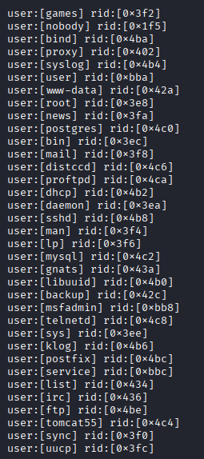

Etapa 2: Criando a wordlist para o SMB
  - Criando uma wordlist para smb_users.txt

    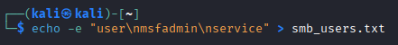

- Criando uma wordlist para senhas_spray.txt

    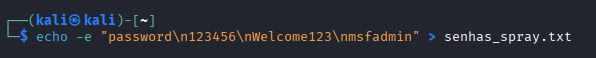

Etapa 3: Executar o medusa para o SMB

  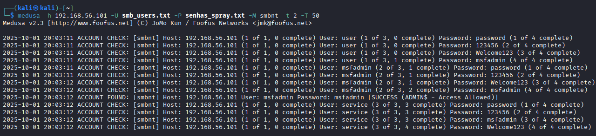

  -h: Utilizado para determinar o host do ataque - 192.168.56.101

  -U: Utilizado para determinar um arquivo de lista de usernames - smb_users.txt

  -P: Utilizado para determinar um arquivo de lista de passwords - senhas_spray.txt

  -M: Especifica o serviço a ser atacado - SMB

  -t: Numero de tentativas (threads) por vez (quanto maior o numero, mais rapido, porém mais facil de detectar) - 2

  -T: Quantidade de hosts paralelos - 50

Etapa 4: Conectando no serviço SMB

  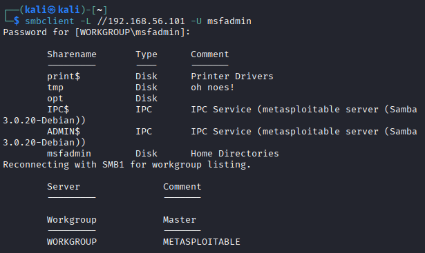
